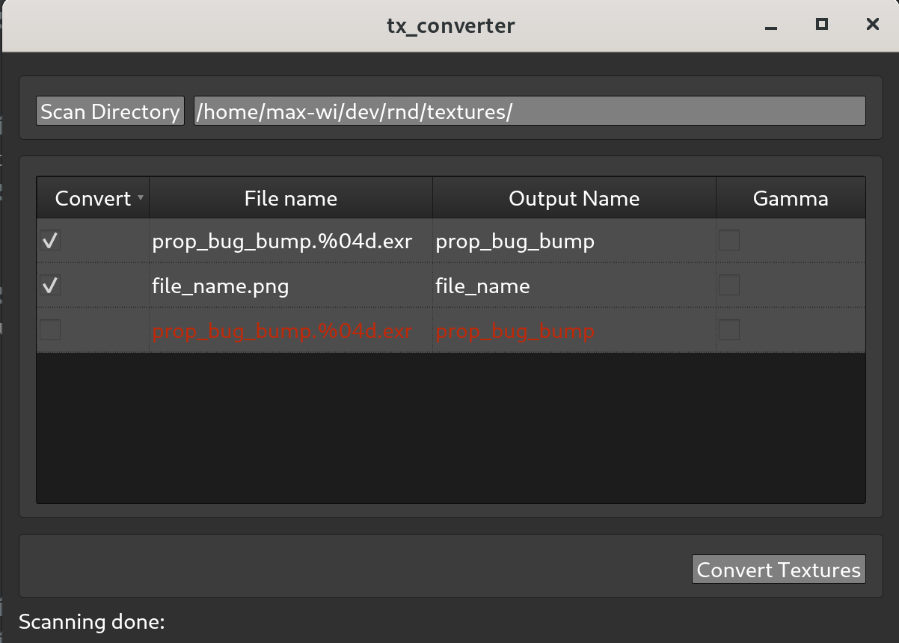

# Purpose
Tool for converting textures to tx files.
#

## Dependencies
|      Name                                                    |
|:------------------------------------------------------------:|
| [PySide2](https://github.com/pyside/pyside2-setup)           |
| [Qt.py](https://github.com/mottosso/Qt.py)                   |
| [ImageSequence](https://github.com/maxWiklund/ImageSequence) |
| [OpenImageIO (maketx)](https://github.com/OpenImageIO/oiio)  |

